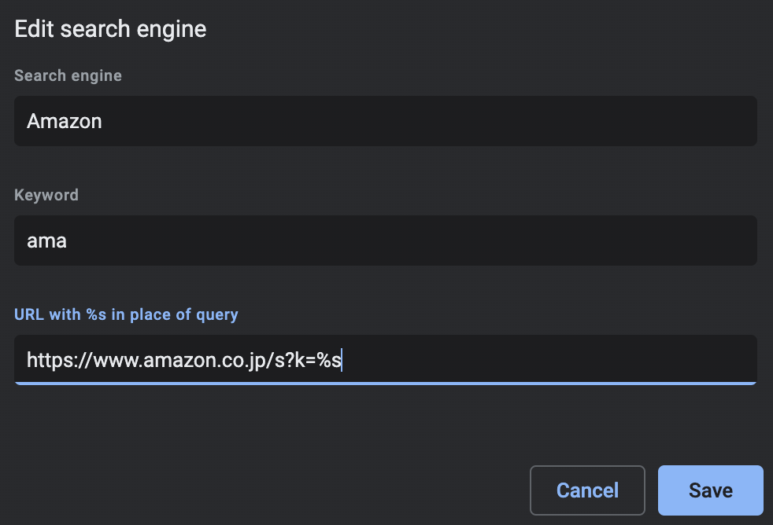

# Chrome 検索エンジンの設定

Chrome に元からある機能．

アドレスバーでサイト内検索を可能にする．

Bookmark の代わりにもなる．

参考：[https://zapier.com/blog/add-search-engine-to-chrome/](https://zapier.com/blog/add-search-engine-to-chrome/)

例：

## サイト内検索

| Search Engine  | Keyword | URL                                                            |
| -------------- | ------- | -------------------------------------------------------------- |
| Amazon         | ama     | https://www.amazon.co.jp/s?k=%s                                |
| Google Scholar | gc      | https://scholar.google.com/scholar?hl=ja&as_sdt=0%2C5&q=%s     |
| YouTube        | you     | https://www.youtube.com/results?search_query=%s                |
| 東工大図書館   | lib     | https://topics.libra.titech.ac.jp/xc/search/%s                 |
| Google US      | us      | https://www.google.com/search?q=%s&gl=us&hl=en&gws_rd=cr&pws=0 |

Google US: US で地域指定して検索．英語検索する際に有用．

## Bookmark 代わり

| Search Engine        | Keyword                     | URL                                                                                                |
| -------------------- | --------------------------- | -------------------------------------------------------------------------------------------------- |
| Google Calendar      | cal                         | https://calendar.google.com/calendar/u/0/r?tab=rc                                                  |
| Gmail                | gm                          | https://mail.google.com/mail/u/0/?tab=rm&ogbl#inbox                                                |
| Google Drive         | drive                       | https://drive.google.com/drive/my-drive                                                            |
| Google Colab         | colab                       | https://colab.research.google.com/                                                                 |
| Overleaf             | ol https://www.overleaf.com |
| Chrome Search Engine | se                          | chrome://settings/searchEngines                                                                    |
| 東工大 OCWi          | tit                         | https://portal.nap.gsic.titech.ac.jp/GetAccess/Login?Template=userpass_key&AUTHMETHOD=UserPassword |
