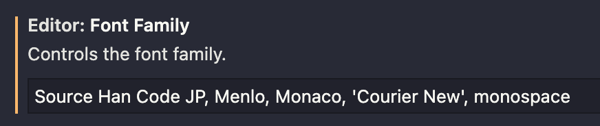

# プログラミング用フォント

## フォントの分類

- プロポーショナル (proportional) フォント
- 等幅 (monospaced) フォント


画像元：[Monospaced font - Wikipedia](https://en.wikipedia.org/wiki/Monospaced_font)

## 日本語対応のプログラミングフォント

1. [Ricty Diminished](https://rictyfonts.github.io/diminished)

   - 特徴：半角・全角文字の横幅の比率は 1:2
   - 長所：インストールが簡単．[Mac へのインストール法](https://hajipro.com/local-development-environment-mac/ricty-diminished)
   - 短所：アルファベットが細すぎて読みにくい

2. [Source Han Code JP | 源ノ角ゴシック](https://github.com/adobe-fonts/source-han-code-jp)

   - 特徴：半角・全角文字の横幅の比率は 2:3
   - 長所：半角・全角のバランスが良い
   - 短所：インストールが少したいへん，文字幅が広めで横に膨らみがち

## 源ノ角ゴシックのインストール方法

1. [Source Han Code JP | 源ノ角ゴシック](https://github.com/adobe-fonts/source-han-code-jp) からソースをダウンロード
2. 下記コマンドで Adobe の開発者ツールを入れる

   ```shell
   $ python3 -m venv afdko_env
   $ source afdko_env/bin/activate
   $ pip3 install afdko
   ```

3. ソースのルートディレクトリに移動し，ビルドコマンドを実行

   ```shell
   $ ./commands.sh
   ```

4. 生成されたフォントファイルを Font Book で読み込む
5. `$ fc-list | grep Han` で見つかれば OK

## VSCode でのフォント設定

設定の `Editor: Font Familiy`に `Source Han Code JP` 等を追加する．


